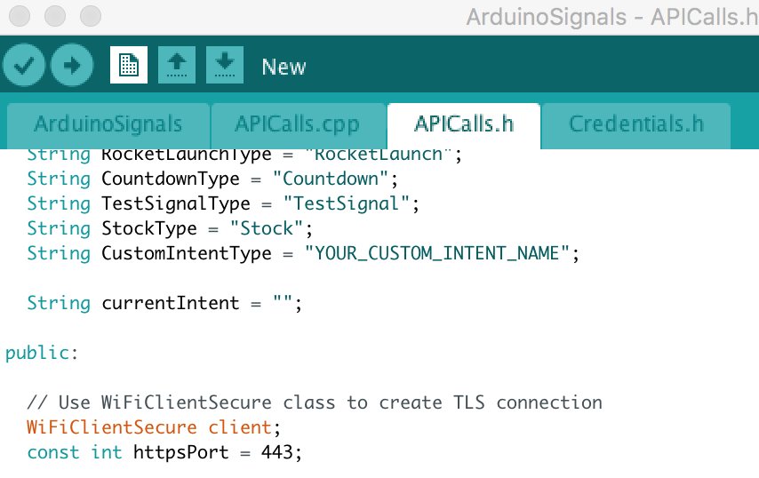
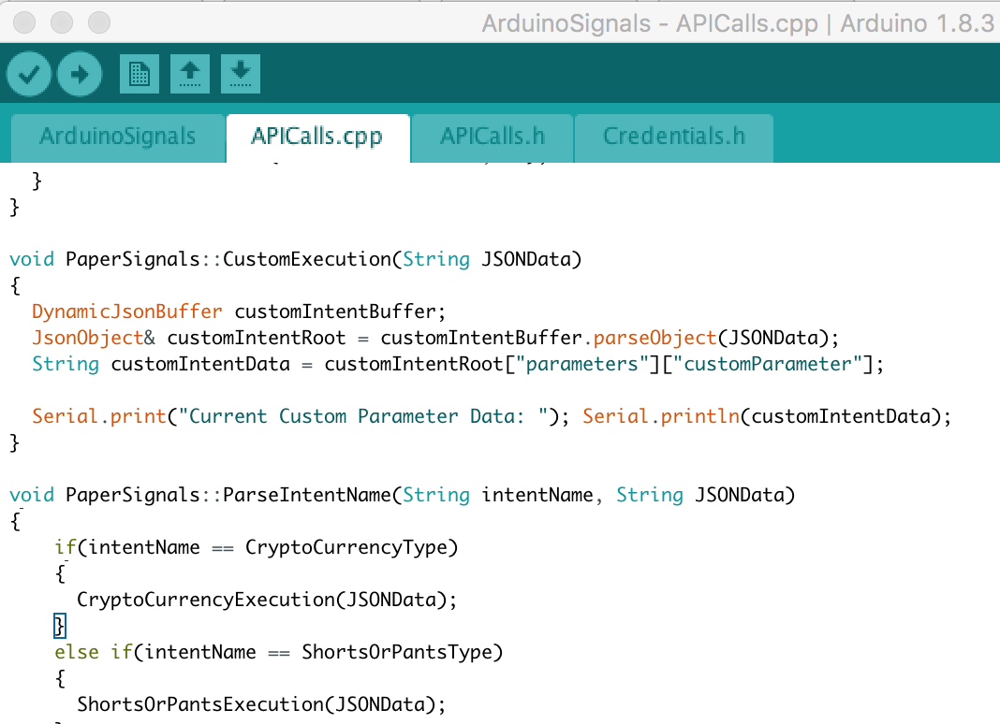
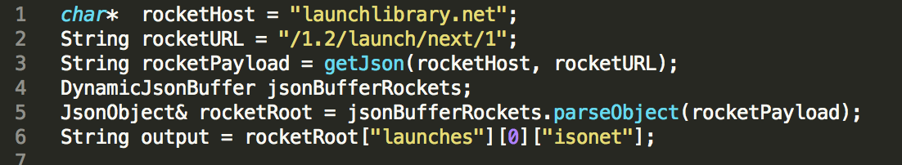
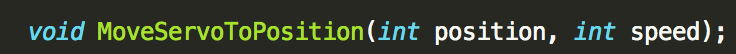
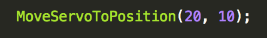

# Paper Signals
Paper Signals is a [Voice Experiment](https://experiments.withgoogle.com/voice) that lets you make little voice controlled objects that track simple things, like weather. You can build any of the example Paper Signals we have on [g.co/papersignals](https://papersignals.withgoogle.com/#), or use this repo to make your own Custom Signal. 

This is an experiment, not an official Google product. We will do our best to support and maintain this experiment but your mileage may vary.

## Technology
Paper Signals is built on [Actions on Google](https://developers.google.com/actions/), the platform that allows you to make things for the Google Assistant and the Google Home. It uses [Dialogflow](https://dialogflow.com/) to handle understanding what the user says, [Firebase Cloud Functions](https://firebase.google.com/docs/functions/) and [Firebase Database](https://firebase.google.com/docs/database/) for backend code and storing data, and Arduino for programming the electronics. 

This repo contains the Arduino files used to make API calls and move servos. This lets users set up their own individual signals using the same Firebase and Actions backend that our pre-made examples use. 

Instructions for how to set up one of the pre-made, example signals can be found at [g.co/papersignals](https://papersignals.withgoogle.com/#) (including a more detailed explanation for setting up the electronics). Below in this README, we include instructions on how to make a Custom Signal and set up a Custom Intent.

### Custom Intents
Custom Intents allow you to program your Paper Signal to track anything with a few lines of code and voice commands. Creating and programming a custom intent can be done in 4 steps.

1. Open the Paper Signals code in Arduino and use the tabs to open the APICalls.h file.

2. Give your custom intent a name and replace the text “YOUR_CUSTOM_INTENT_NAME” with your custom intent’s name!

3. Use the tabs on the top of the Arduino Software to open the APICalls.cpp file.

4. Find the function called CustomExecution()

5. Any code written in this function will run when you ask Paper Signals to run your custom intent. The variable CustomIntentData is a string that represents any parameter you gave your custom intent.

6. To run your custom intent, open Paper Signals and say “Talk to Paper Signals”, then “Create a new Signal called Custom Signal.” Once you have that created, say “set my Custom Signal to a custom intent named __<CUSTOM INTENT NAME>__”

	* __Example__: “Set my __Custom Signal__ to a custom intent named power.”
	*In this example, Custom Signal is the signal name and Power is the custom 
intent name.*

7. To set a parameter for your custom intent to use, say: “Set the custom Parameter for __Custom Signal__ to __<CUSTOM PARAMETER>__”

	* __Example__: set the custom parameter for Custom Signal to Fast. 
	*In this example, __Custom Signal__’s custom intent is going to use __Fast__ as a custom Parameter*

### Programming Your Custom Intent Functions
You will usually want to move servos and check online APIs with your custom intents, so there are 2 chunks of very useful code to understand.

* Getting API Data
	* The code below shows the standard Paper Signals boilerplate for grabbing data from a remote API. This particular examples shows how we get rocket launch times as a string!

* Moving Servos
	* Paper Signals has a function for moving a servo with default settings. The position argument of this function takes an angle between 0 and 180 (This is the angle that the servo will move to), and speed takes an integer. Speed is actually the amount of time spent on each single angle of the servo. So a lower speed value will make the servo move faster. 
	* The example below moves the servo to 20 degrees, spending 10ms on each degree between the angle the servo is started at and the destination. 

## Contributors
Made by [Isaac Blankensmith](http://www.isaacblankensmith.com/), [Dylan Fashbaugh](https://github.com/dfashbaugh), [Jacob Keith](https://github.com/KacobJeith), and [James DeVito](https://github.com/jmzjmzjmz) with [Smooth Technology](https://smooth.technology) and friends at the Google Creative Lab.

### Other Contributors
* [Nicole He](https://github.com/nicolehe)
* [Dan Motzenbecker](https://github.com/dmotz)

## License
Copyright 2017 Google Inc.
Licensed under the Apache License, Version 2.0 (the "License"); you may not use this file except in compliance with the License. You may obtain a copy of the License at
http://www.apache.org/licenses/LICENSE-2.0

Unless required by applicable law or agreed to in writing, software distributed under the License is distributed on an "AS IS" BASIS, WITHOUT WARRANTIES OR CONDITIONS OF ANY KIND, either express or implied. See the License for the specific language governing permissions and limitations under the License.

## Final Thoughts
We encourage open sourcing projects as a way of learning from each other. Please respect our and other creators’ rights, including copyright and trademark rights when present, when sharing these works and creating derivative work.
If you want more info on Google's policy, you can find that [here](https://www.google.com/policies/).

